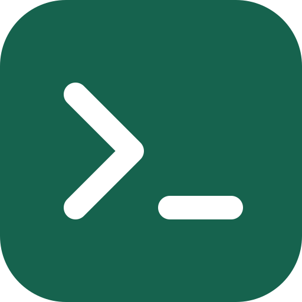

<p align="center">
  
</p>

# term-llm

Terminal-first AI runtime for commands, chat, editing, tools, jobs, agents, and local workflows.

[](https://github.com/samsaffron/term-llm/releases)

Docs hub: **https://term-llm.com**

## Why it exists

- turn natural language into executable shell commands
- run persistent chat with tools and MCP servers
- edit files with model assistance
- support agents, skills, sessions, jobs, and local automation
- work with hosted or local models

```bash
$ term-llm exec "find all go files modified today"

> find . -name "*.go" -mtime 0   Uses find with name pattern
  fd -e go --changed-within 1d   Uses fd (faster alternative)
  find . -name "*.go" -newermt "today"   Alternative find syntax
  something else...
```

## Install

```bash
curl -fsSL https://raw.githubusercontent.com/samsaffron/term-llm/main/install.sh | sh
```

For a source build, clone the repository and build from its root. This requires Go, Node.js 24 or newer, npm, and Make:

```bash
git clone https://github.com/samsaffron/term-llm.git
cd term-llm
make build
./term-llm version
```

`make build` installs the locked frontend dependencies when needed, generates the embedded web UI, and then builds the Go binary. The generated frontend bundles are intentionally not checked into Git, so plain `go build` from a fresh checkout will fail until `make frontend` has run.

`go install github.com/samsaffron/term-llm@latest` cannot build this repository: in addition to the generated frontend prerequisite, the application intentionally uses local `replace` directives for the owned Bubble Tea, Ultraviolet, and reflow modules. Use the installer/release archive or `make build` from a complete checkout.

Shell completions are available for Bash, Zsh, Fish, and PowerShell. Fish users can install an auto-loaded completion file with:

```fish
term-llm config completion fish --install
```

See the [installation guide](https://term-llm.com/getting-started/installation/#shell-completions) for every shell and manual setup.

## 30-second quickstart

No API key needed if you use Zen:

```bash
term-llm exec --provider zen "list files"
term-llm ask --provider zen "explain git rebase"
term-llm chat
```

If you already have a provider key:

```bash
export ANTHROPIC_API_KEY=your-key
# or OPENAI_API_KEY / GEMINI_API_KEY / OPENROUTER_API_KEY / XAI_API_KEY / NEARAI_API_KEY / SAMBANOVA_API_KEY
```

## Read the docs

The detailed docs live at **https://term-llm.com** and are authored in Markdown in this repo, then built with Hugo.

- [Getting started](https://term-llm.com/getting-started/)
- [Guides](https://term-llm.com/guides/)
- [Architecture](https://term-llm.com/architecture/)
- [Reference](https://term-llm.com/reference/)

Common entry points:

- [Configuration](https://term-llm.com/reference/configuration/)
- [Providers and models](https://term-llm.com/reference/providers-and-models/)
- [Web UI and API](https://term-llm.com/guides/web-ui-and-api/)
- [Search](https://term-llm.com/guides/search/)
- [Usage](https://term-llm.com/guides/usage/)
- [Agents](https://term-llm.com/guides/agents/)
- [Skills](https://term-llm.com/guides/skills/)
- [MCP servers](https://term-llm.com/guides/mcp-servers/)
- [Memory](https://term-llm.com/guides/memory/)
- [Jobs](https://term-llm.com/guides/job-runner/)
- [Text embeddings](https://term-llm.com/guides/text-embeddings/)
- [Audio generation](https://term-llm.com/guides/audio-generation/)
- [Music generation](https://term-llm.com/guides/music-generation/)
- [Usage tracking](https://term-llm.com/reference/usage-tracking/)
- [Transcription](https://term-llm.com/guides/transcription/)
- [Notifications](https://term-llm.com/guides/notifications/)

## Contributing

The root `go test ./...` command does not cross Go module boundaries. During development, use Go's standard short mode to skip subprocess-heavy integration tests:

```bash
go test -short ./...
```

Before submitting or merging, generate the frontend and run the complete root suite plus the owned nested-module verification:

```bash
make build
go test ./...
go vet ./...
scripts/verify_nested_modules.sh
VERIFY_RACE=1 scripts/verify_nested_modules.sh
```

The terminal event loop/runtime and cell/diff/output renderer under `internal/terminal/` are deliberately reduced, application-owned source modules rather than external dependency copies. They preserve the Bubble Tea and Ultraviolet module paths only because Bubbles and Huh require exact import and concrete type identity. See [`internal/terminal/README.md`](internal/terminal/README.md) for the ownership contract, architecture, provenance, selective-sync workflow, fuzz/benchmark commands, and cross-build matrix. Run `scripts/cross_build_owned_terminal.sh` when changing platform- or release-sensitive terminal code.

## License

MIT
